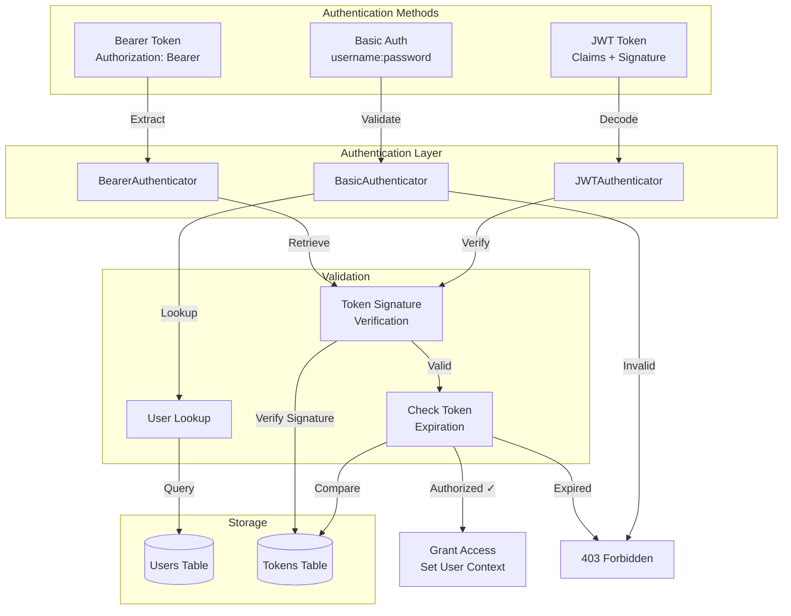
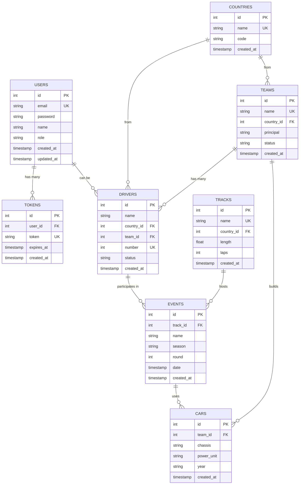
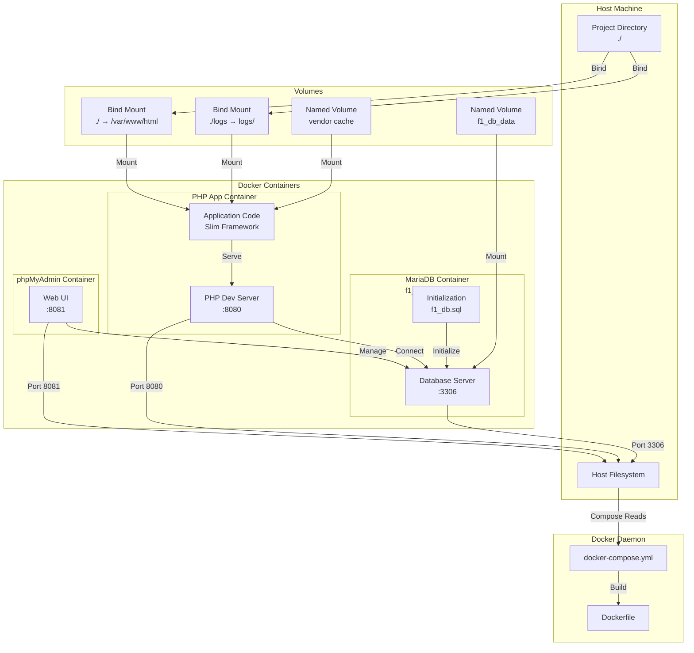
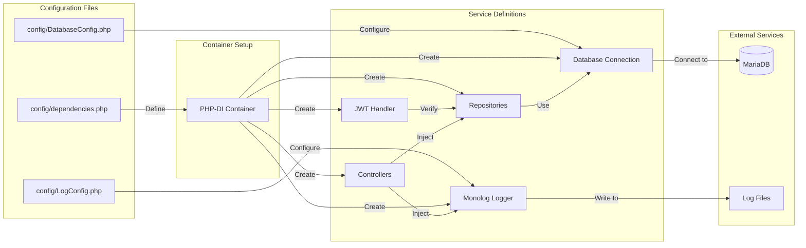
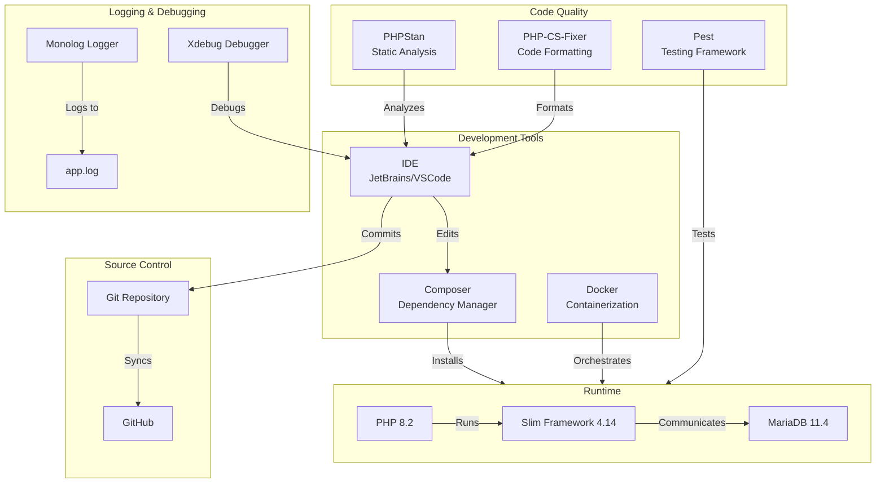
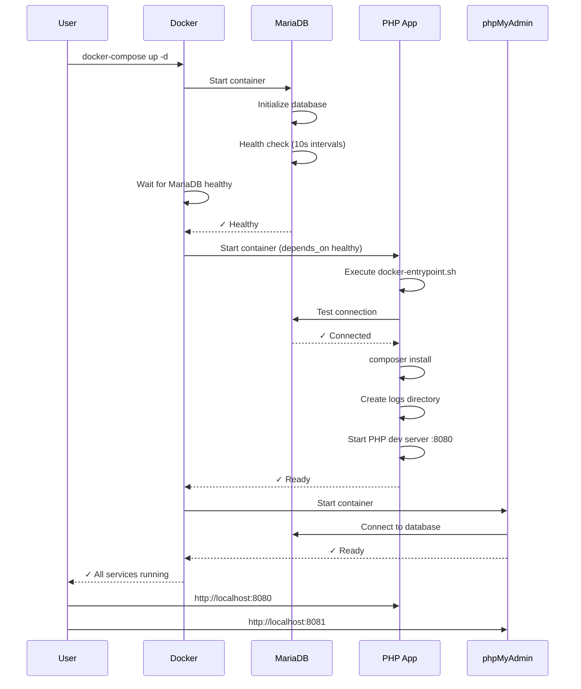

# F1 Management API - Detailed System Diagrams

## 1. Request Flow Diagram

```mermaid
graph LR
    Start([HTTP Request]) -->|" GET /drivers "| Entry["Entry Point:<br/>public/index.php"]
    Entry -->|Bootstrap| Config["Load Configuration"]
    Config -->|Container Setup| DI["Dependency Injection<br/>Container"]
    DI -->|Route Matching| Router["Slim Router"]
    Router -->|Middleware Stack| Auth["Authentication<br/>Middleware"]
    Auth -->|Token Validation| JWT["JWT Verification"]
    JWT -->|✓ Valid Token| Controller["Route Handler<br/>Controller"]
    JWT -->|✗ Invalid| Error401["401 Unauthorized"]
    Controller -->|Execute Logic| Business["Business Logic"]
    Business -->|Data Access| Repository["Repository Pattern"]
    Repository -->|ORM Query| Eloquent["Eloquent ORM"]
    Eloquent -->|SQL| Database["MariaDB"]
    Database -->|Result Set| Eloquent
    Eloquent -->|Collection| Repository
    Repository -->|Domain Objects| Business
    Business -->|Format| Presenter["Response Presenter"]
    Presenter -->|JSON| Response["HTTP Response"]
    Response -->|200/201/404/500| Client([Client])
    Error401 -->|Error Response| Client
```



## 2. Authentication Architecture



## 3. Database Schema Relationship Diagram



## 4. Container & Volume Architecture



## 5. Dependency Injection Container



## 6. API Endpoint Architecture

```mermaid
graph TD
    API["F1 Management API<br/>Base: /"]
    API -->|/auth| AuthEndpoints["Authentication"]
    API -->|/cars| CarEndpoints["Cars Resource"]
    API -->|/drivers| DriverEndpoints["Drivers Resource"]
    API -->|/teams| TeamEndpoints["Teams Resource"]
    API -->|/events| EventEndpoints["Events Resource"]
    API -->|/tracks| TrackEndpoints["Tracks Resource"]
    AuthEndpoints -->|POST /login| Login["User Login"]
    AuthEndpoints -->|POST /register| Register["User Registration"]
    AuthEndpoints -->|POST /refresh| Refresh["Token Refresh"]
    AuthEndpoints -->|POST /logout| Logout["User Logout"]
    CarEndpoints -->|GET /| ListCars["List All Cars"]
    CarEndpoints -->|POST /| CreateCar["Create Car"]
    CarEndpoints -->|GET /:id| GetCar["Get Car Details"]
    CarEndpoints -->|PUT /:id| UpdateCar["Update Car"]
    CarEndpoints -->|DELETE /:id| DeleteCar["Delete Car"]
    DriverEndpoints -->|GET /| ListDrivers["List All Drivers"]
    DriverEndpoints -->|POST /| CreateDriver["Create Driver"]
    DriverEndpoints -->|GET /:id| GetDriver["Get Driver Details"]
    DriverEndpoints -->|PUT /:id| UpdateDriver["Update Driver"]
    DriverEndpoints -->|DELETE /:id| DeleteDriver["Delete Driver"]
    TeamEndpoints -->|GET /| ListTeams["List All Teams"]
    TeamEndpoints -->|POST /| CreateTeam["Create Team"]
    TeamEndpoints -->|GET /:id| GetTeam["Get Team Details"]
    TeamEndpoints -->|PUT /:id| UpdateTeam["Update Team"]
    TeamEndpoints -->|DELETE /:id| DeleteTeam["Delete Team"]
    EventEndpoints -->|GET /| ListEvents["List All Events"]
    EventEndpoints -->|POST /| CreateEvent["Create Event"]
    EventEndpoints -->|GET /:id| GetEvent["Get Event Details"]
    EventEndpoints -->|PUT /:id| UpdateEvent["Update Event"]
    EventEndpoints -->|DELETE /:id| DeleteEvent["Delete Event"]
    TrackEndpoints -->|GET /| ListTracks["List All Tracks"]
    TrackEndpoints -->|POST /| CreateTrack["Create Track"]
    TrackEndpoints -->|GET /:id| GetTrack["Get Track Details"]
    TrackEndpoints -->|PUT /:id| UpdateTrack["Update Track"]
    TrackEndpoints -->|DELETE /:id| DeleteTrack["Delete Track"]
    Login -->|Controller| AuthC["AuthController"]
    Register -->|Controller| AuthC
    Refresh -->|Controller| AuthC
    Logout -->|Controller| AuthC
    ListCars -->|Controller| CarC["CarController"]
    CreateCar -->|Controller| CarC
    GetCar -->|Controller| CarC
    UpdateCar -->|Controller| CarC
    DeleteCar -->|Controller| CarC
    ListDrivers -->|Controller| DriverC["DriverController"]
    CreateDriver -->|Controller| DriverC
    GetDriver -->|Controller| DriverC
    UpdateDriver -->|Controller| DriverC
    DeleteDriver -->|Controller| DriverC
    ListTeams -->|Controller| TeamC["TeamController"]
    CreateTeam -->|Controller| TeamC
    GetTeam -->|Controller| TeamC
    UpdateTeam -->|Controller| TeamC
    DeleteTeam -->|Controller| TeamC
    ListEvents -->|Controller| EventC["EventController"]
    CreateEvent -->|Controller| EventC
    GetEvent -->|Controller| EventC
    UpdateEvent -->|Controller| EventC
    DeleteEvent -->|Controller| EventC
    ListTracks -->|Controller| TrackC["TrackController"]
    CreateTrack -->|Controller| TrackC
    GetTrack -->|Controller| TrackC
    UpdateTrack -->|Controller| TrackC
    DeleteTrack -->|Controller| TrackC
```



## 7. Development & Deployment Stack



## 8. Docker Startup Sequence



## Legend

```
🌐 = Web/Network
📁 = File System
📝 = Logs
📦 = Packages/Dependencies
💾 = Database Storage
📱 = Mobile/Client
⚙️ = Configuration/Tools
🗄️ = Database
```

